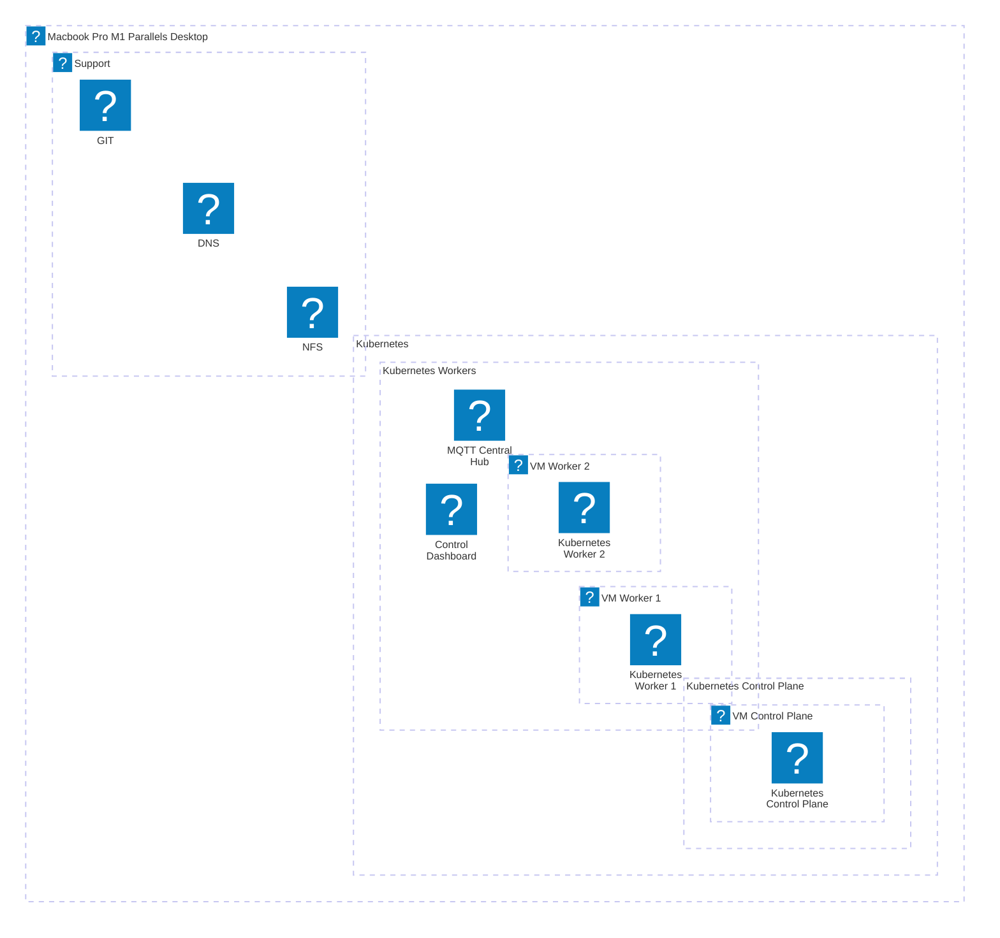
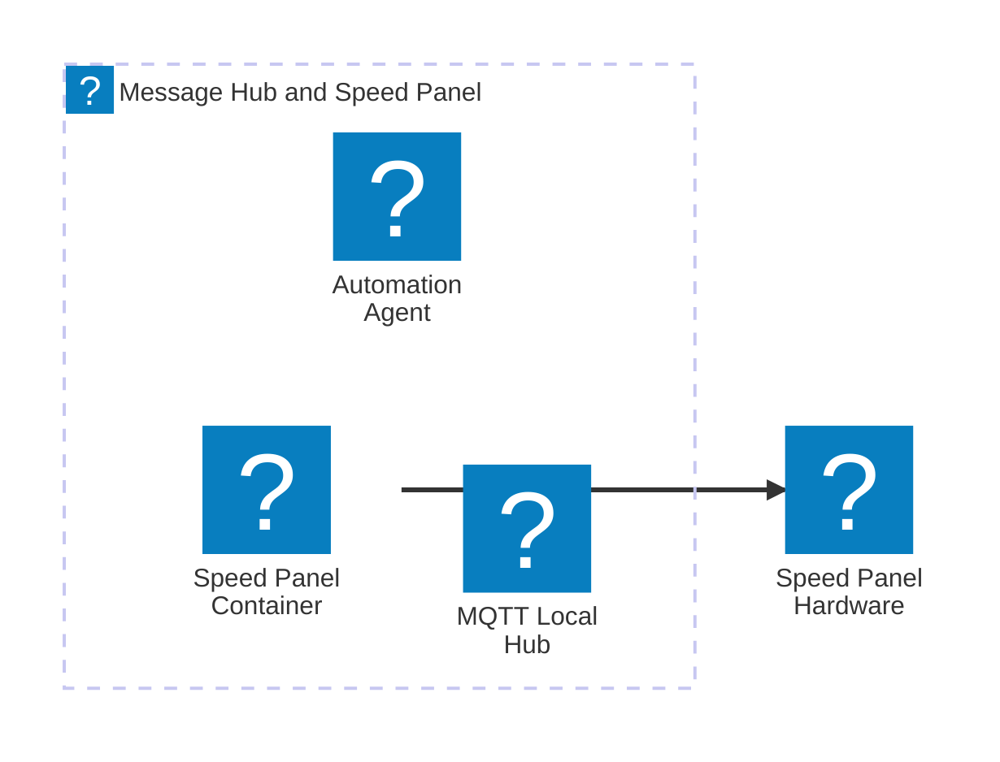
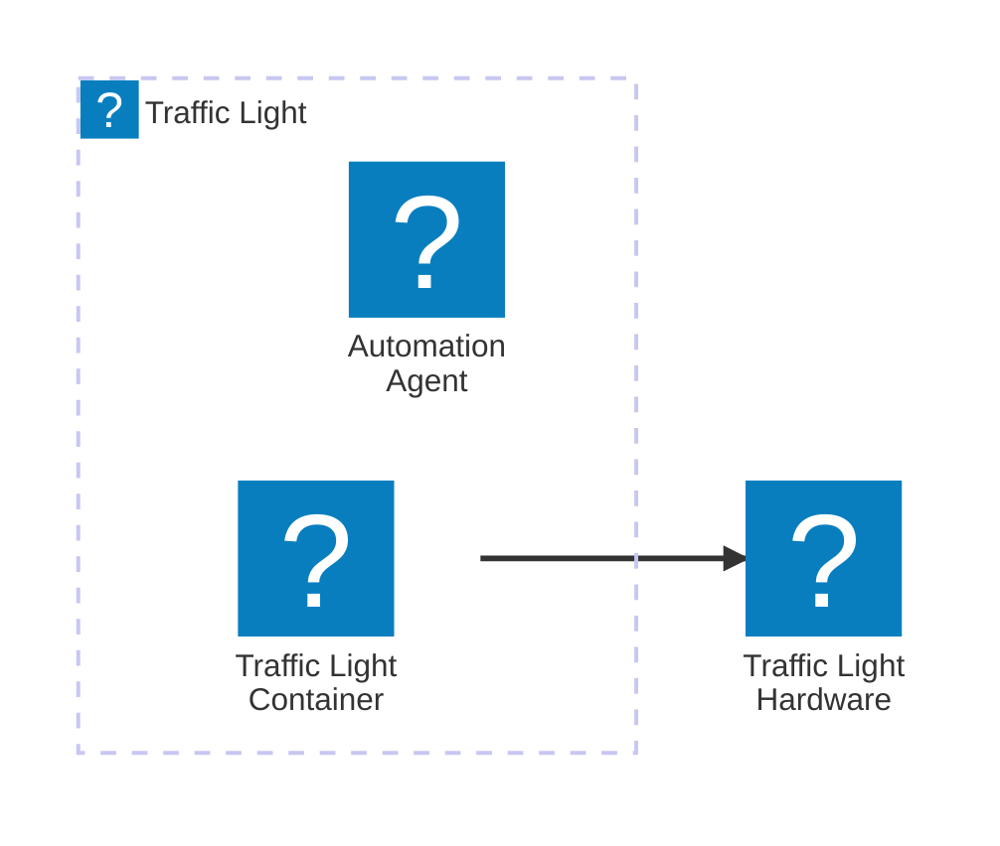

### Macbook Pro M1

```mermaid
architecture-beta
    group m1(logos:apple)[Macbook Pro M1  Parallels Desktop]
    group k8s[Kubernetes] in m1
    group support(logos:debian)[Support] in m1
    
    group controlplane[Kubernetes Control Plane] in k8s
    group vmcontrolplane(logos:ubuntu)[VM Control Plane] in controlplane

    group workers[Kubernetes Workers] in k8s

    group vmworker1(logos:ubuntu)[VM Worker 1] in workers
    group vmworker2(logos:ubuntu)[VM Worker 2] in workers

    
    service k8sm(logos:kubernetes)[Kubernetes Control Plane] in vmcontrolplane
    service nfs(arcticons:nfs-no-limits)[NFS] in support
    service dns(arcticons:dns-changer-3)[DNS] in support
    service gitea(logos:git)[GIT] in support
    
    service k8sw1(logos:kubernetes)[Kubernetes Worker 1] in vmworker1

    service k8sw2(logos:kubernetes)[Kubernetes Worker 2] in vmworker2

    service cd(carbon:dashboard)[Control Dashboard] in workers
    service mqtt(simple-icons:mqtt)[MQTT Central Hub] in workers

```

### Raspberry Pi 8GB [Speed Panel, MQTT Hub]

```mermaid
architecture-beta
    group debian(logos:debian)[Message Hub and Speed Panel]
    service mqtt(simple-icons:mqtt)[MQTT Local Hub] in debian
    service sp(devicon:podman)[Speed Panel Container] in debian
    service sph(arcticons:device-connect) [Speed Panel Hardware]
    sp{group}:R --> L:sph
    service agent(carbon:settings-services)[Automation Agent] in debian
```

### Raspberry Pi 4GB [Traffic Light]

```mermaid
architecture-beta
    group debian(logos:debian)[Traffic Light]
    service tf(devicon:podman)[Traffic Light Container] in debian
    service tfh(arcticons:device-connect) [Traffic Light Hardware]
    tf{group}:R --> L:tfh
    service agent(carbon:settings-services)[Automation Agent] in debian

```

### Geographical Distribution

