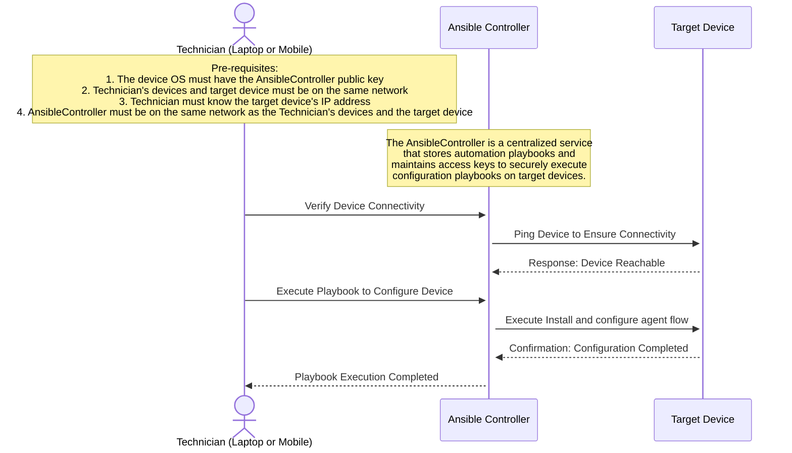
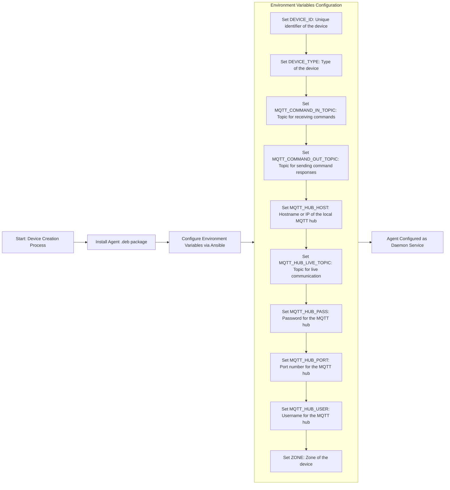
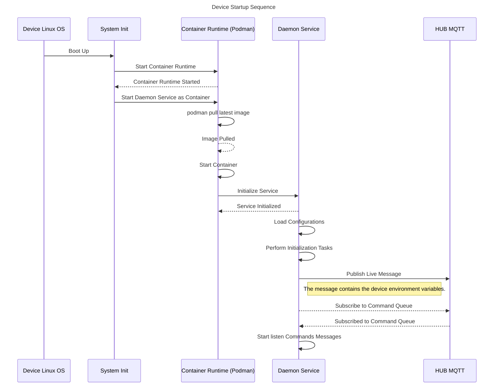

## Device creation Process

### Execution process

```mermaid
sequenceDiagram
    actor Technician as Technician (Laptop or Mobile)
    participant AnsibleController as Ansible Controller
    participant Device as Target Device
    Note over Technician: Pre-requisites:<br/>1. The device OS must have the AnsibleController public key<br/>2. Technician's devices and target device must be on the same network<br/>3. Technician must know the target device's IP address<br/>4. AnsibleController must be on the same network as the Technician's devices and the target device
    Note over AnsibleController: The AnsibleController is a centralized service<br/>that stores automation playbooks and<br/>maintains access keys to securely execute<br/>configuration playbooks on target devices.
    Technician->>+AnsibleController: Verify Device Connectivity
    AnsibleController->>+Device: Ping Device to Ensure Connectivity
    Device-->>AnsibleController: Response: Device Reachable
    Technician->>+AnsibleController: Execute Playbook to Configure Device
    AnsibleController->>+Device: Execute Install and configure agent flow
    Device-->>AnsibleController: Confirmation: Configuration Completed
    AnsibleController-->>Technician: Playbook Execution Completed
```

### Install and configure agent flow

```mermaid
flowchart LR
    A[Start: Device Creation Process] --> B[Install Agent .deb package]
    B --> C[Configure Environment Variables via Ansible]
    subgraph EnvVariablesConfig[Environment Variables Configuration]
        VAR1[Set DEVICE_ID: Unique identifier of the device]
        VAR1 --> VAR2[Set DEVICE_TYPE: Type of the device]
        VAR2 --> VAR3[Set MQTT_COMMAND_IN_TOPIC: Topic for receiving commands]
        VAR3 --> VAR4[Set MQTT_COMMAND_OUT_TOPIC: Topic for sending command responses]
        VAR4 --> VAR5[Set MQTT_HUB_HOST: Hostname or IP of the local MQTT hub]
        VAR5 --> VAR6[Set MQTT_HUB_LIVE_TOPIC: Topic for live communication]
        VAR6 --> VAR7[Set MQTT_HUB_PASS: Password for the MQTT hub]
        VAR7 --> VAR8[Set MQTT_HUB_PORT: Port number for the MQTT hub]
        VAR8 --> VAR9[Set MQTT_HUB_USER: Username for the MQTT hub]
        VAR9 --> VAR10[Set ZONE: Zone of the device]
    end
    C --> EnvVariablesConfig
    EnvVariablesConfig --> D[Agent Configured as Daemon Service]
```

### Linux Service Startup Sequence with Container Runtime

```mermaid
sequenceDiagram
    title Device Startup Sequence

    participant System as Device Linux OS
    participant Init as System Init
    participant ContainerRuntime as Container Runtime (Podman)
    participant Service as Daemon Service
    participant MQTT as HUB MQTT

    System->>Init: Boot Up
    Init->>ContainerRuntime: Start Container Runtime
    ContainerRuntime-->>Init: Container Runtime Started
    Init->>ContainerRuntime: Start Daemon Service as Container
    ContainerRuntime->>ContainerRuntime: podman pull latest image
    ContainerRuntime-->>ContainerRuntime: Image Pulled
    ContainerRuntime->>ContainerRuntime: Start Container
    ContainerRuntime->>Service: Initialize Service
    Service-->>ContainerRuntime: Service Initialized
    Service->>Service: Load Configurations
    Service->>Service: Perform Initialization Tasks
    Service->>MQTT: Publish Live Message
    Note right of Service: The message contains the device environment variables.
    Service-->>MQTT: Subscribe to Command Queue
    MQTT-->>Service: Subscribed to Command Queue
    Service->>Service: Start listen Commands Messages
```