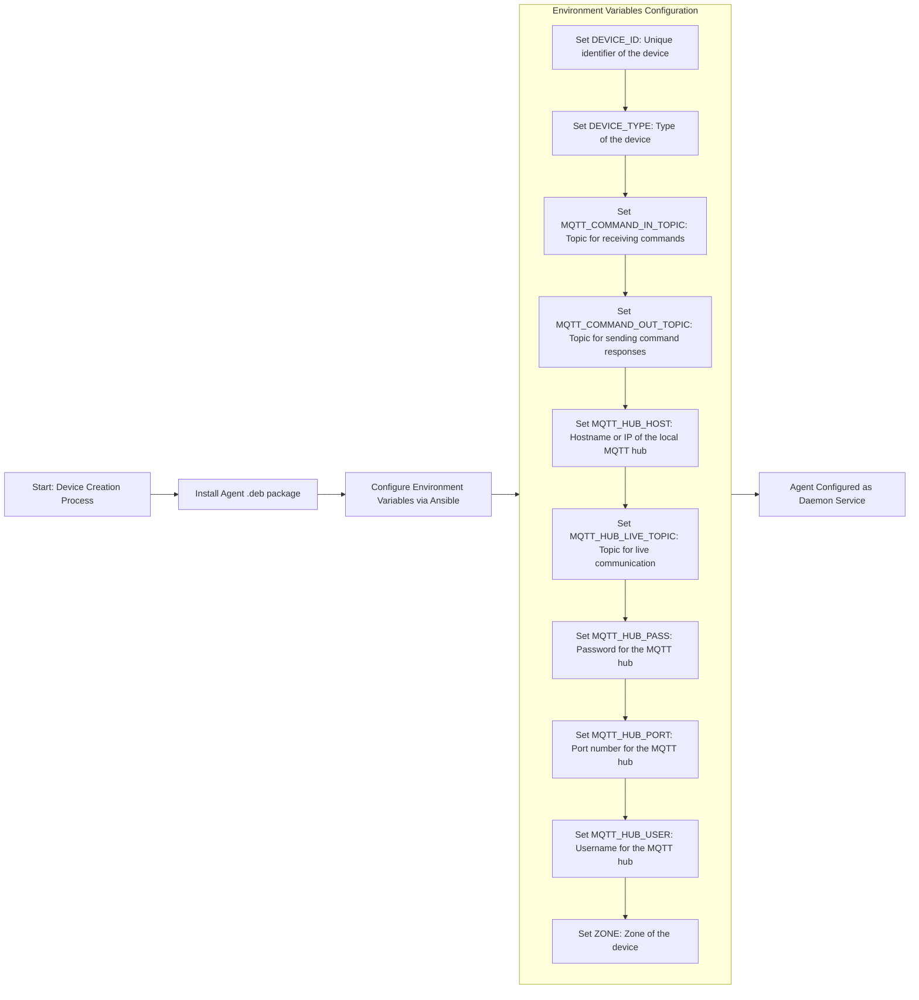

## Device creation Process
### Step 1

```mermaid
flowchart LR
    A[Start: Device Creation Process] --> B[Install Agent .deb package]
    B --> C[Configure Environment Variables via Ansible]
    subgraph EnvVariablesConfig[Environment Variables Configuration]
        VAR1[Set DEVICE_ID: Unique identifier of the device]
        VAR1 --> VAR2[Set DEVICE_TYPE: Type of the device]
        VAR2 --> VAR3[Set MQTT_COMMAND_IN_TOPIC: Topic for receiving commands]
        VAR3 --> VAR4[Set MQTT_COMMAND_OUT_TOPIC: Topic for sending command responses]
        VAR4 --> VAR5[Set MQTT_HUB_HOST: Hostname or IP of the local MQTT hub]
        VAR5 --> VAR6[Set MQTT_HUB_LIVE_TOPIC: Topic for live communication]
        VAR6 --> VAR7[Set MQTT_HUB_PASS: Password for the MQTT hub]
        VAR7 --> VAR8[Set MQTT_HUB_PORT: Port number for the MQTT hub]
        VAR8 --> VAR9[Set MQTT_HUB_USER: Username for the MQTT hub]
        VAR9 --> VAR10[Set ZONE: Zone of the device]
    end
    C --> EnvVariablesConfig
    EnvVariablesConfig --> D[Agent Configured as Daemon Service]
```