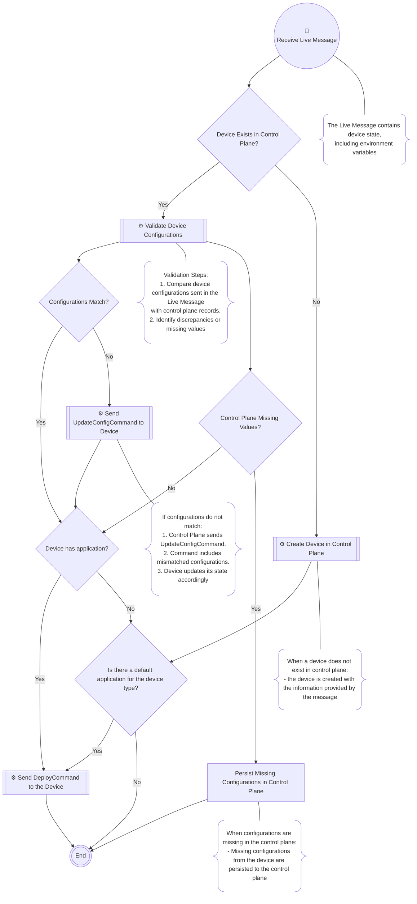

```mermaid
flowchart TD
    ReceiveMessage@{ shape: circle, label: "📩 <br/>Receive Live Message" }
    ReceiveMessage --> DeviceExists@{ shape: decision, label: "Device Exists in Control Plane?" }
    ReceiveMessage --- NoteReceive@{ shape: braces, label: "The Live Message contains device state,<br/>including environment variables" }

    %% Device existence check
    DeviceExists -- Yes --> ValidateConfigurations@{ shape: subproc, label: "⚙️ Validate Device Configurations"}
    DeviceExists -- No --> CreateDevice@{ shape: subproc, label: "⚙️ Create Device in Control Plane"}
    CreateDevice --> DefaultApplication{ Is there a default application for the device type? }
    CreateDevice --- NoteCreate@{ shape: braces, label: "When a device does not exist in control plane:<br/>- the device is created with the information provided by the message"}

    %% Validation configurations path
    ValidateConfigurations --> ConfigurationsMatch{Configurations Match?}
    ConfigurationsMatch -- Yes --> DeviceHasApplication{Device has application?}
    ConfigurationsMatch -- No --> UpdateCommand@{ shape: subproc, label: "⚙️ Send UpdateConfigCommand to Device"}
    UpdateCommand --> DeviceHasApplication
    ValidateConfigurations --- NoteValidate@{ shape: braces, label: "Validation Steps:<br/>1. Compare device configurations sent in the Live Message<br/>with control plane records.<br/>2. Identify discrepancies or missing values" }
    UpdateCommand --- NoteUpdate@{ shape: braces, label: "If configurations do not match:<br/>1. Control Plane sends UpdateConfigCommand.<br/>2. Command includes mismatched configurations.<br/>3. Device updates its state accordingly"}

    %% Control Plane Missing Values Path
    ValidateConfigurations --> MissingValues{Control Plane Missing Values?}
    
    PersistConfig --> End@{ shape: dbl-circ, label: "End" }
    MissingValues -- No --> DeviceHasApplication
    PersistConfig --- NotePersist@{ shape: braces, label: "When configurations are missing in the control plane:<br/>- Missing configurations from the device are persisted to the control plane" }

    %% check if there is any application marked as default for the device type
    DefaultApplication -- Yes --> DeployCommand@{ shape: subproc, label: "⚙️ Send DeployCommand to the Device"}
    DefaultApplication -- No --> End

    MissingValues -- Yes --> PersistConfig[Persist Missing Configurations in Control Plane]

    %% Check if the device has an application associated with it
    DeviceHasApplication -- Yes --> DeployCommand
    DeviceHasApplication -- No --> DefaultApplication
    DeployCommand --> End
```