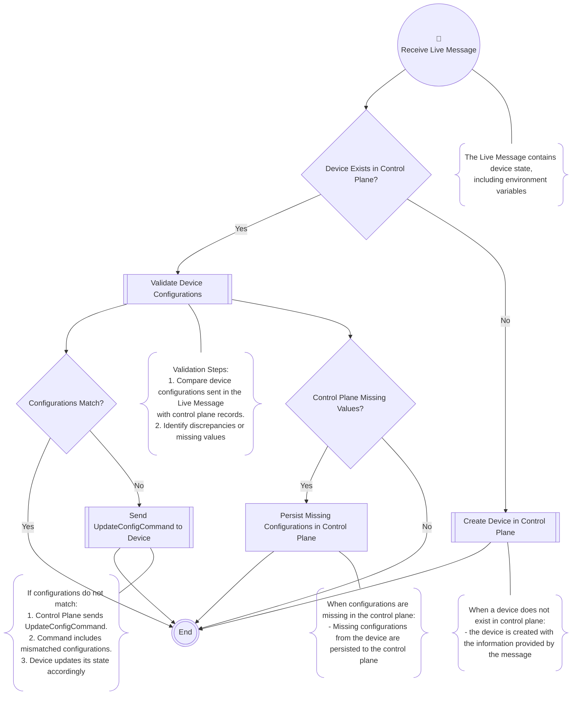

```mermaid
flowchart TD
    ReceiveMessage@{ shape: circle, label: "📩 <br/>Receive Live Message" }
    ReceiveMessage --> DeviceExists{Device Exists in Control Plane?}    
    ReceiveMessage --- NoteReceive

    %% Device existence check
    DeviceExists -- Yes --> ValidateConfigurations@{ shape: subproc, label: "Validate Device Configurations"}
    DeviceExists -- No --> CreateDevice@{ shape: subproc, label: "Create Device in Control Plane"}
    CreateDevice --> End@{ shape: dbl-circ, label: "End" }
    CreateDevice --- NoteCreate

    %% Validation configurations path
    ValidateConfigurations --> ConfigurationsMatch{Configurations Match?}
    ConfigurationsMatch -- Yes --> End
    ConfigurationsMatch -- No --> UpdateCommand@{ shape: subproc, label: "Send UpdateConfigCommand to Device"}
    UpdateCommand --> End
    ValidateConfigurations --- NoteValidate
    UpdateCommand --- NoteUpdate

    %% Control Plane Missing Values Path
    ValidateConfigurations --> MissingValues{Control Plane Missing Values?}
    MissingValues -- Yes --> PersistConfig[Persist Missing Configurations in Control Plane]
    PersistConfig --> End
    MissingValues -- No --> End
    PersistConfig --- NotePersist
    
    NoteReceive@{ shape: braces, label: "The Live Message contains device state,<br/>including environment variables" }
    NoteCreate@{ shape: braces, label: "When a device does not exist in control plane:<br/>- the device is created with the information provided by the message"}
    NoteValidate@{ shape: braces, label: "Validation Steps:<br/>1. Compare device configurations sent in the Live Message<br/>with control plane records.<br/>2. Identify discrepancies or missing values" }
    NoteUpdate@{ shape: braces, label: "If configurations do not match:<br/>1. Control Plane sends UpdateConfigCommand.<br/>2. Command includes mismatched configurations.<br/>3. Device updates its state accordingly"}
    NotePersist@{ shape: braces, label: "When configurations are missing in the control plane:<br/>- Missing configurations from the device are persisted to the control plane" }
```