<p>
This flow is executed by the control plane

```mermaid
flowchart TD
    ReceiveMessage@{ shape: circle, label: "📩 <br/>Receive Live Message" }
    ReceiveMessage --> DeviceExists@{ shape: decision, label: "Device Exists in Control Plane?" }
    ReceiveMessage --- NoteReceive@{ shape: braces, label: "The Live Message contains device state,<br/>including environment variables" }

    End@{ shape: dbl-circ, label: "End" }

    %% Device existence check
    DeviceExists -- Yes --> ValidateConfigurations@{ shape: subproc, label: "⚙️ Validate Device Configurations"}
    DeviceExists -- No --> CreateDevice@{ shape: subproc, label: "⚙️ Create Device in Control Plane"}
    CreateDevice --> CheckDeviceSegment@{shape: decision, label: "Is the device associated with any road segment?" }
    CreateDevice --- NoteCreate@{ shape: braces, label: "When a device does not exist in control plane:<br/>- the device is created with the information provided by the message"}
    CheckDeviceSegment -- Yes --> DefaultApplication{ Is there a default application for the device type? }
    CheckDeviceSegment -- No --> End

    %% Validation configurations path
    ValidateConfigurations --> ConfigurationsMatch{Configurations Match?}
    ConfigurationsMatch -- Yes --> DeviceHasApplication{Device has application?}

    ConfigurationsMatch -- No --> UpdateCommand@{ shape: subproc, label: "⚙️ Send UpdateConfigCommand to Device"}

    
    UpdateCommand --> MissingValues{Control Plane Missing Values?}

    ValidateConfigurations --- NoteValidate@{ shape: braces, label: "Validation Steps:<br/>1. Compare device configurations sent in the Live Message<br/>with control plane records.<br/>2. Identify discrepancies or missing values" }
    UpdateCommand --- NoteUpdate@{ shape: braces, label: "If configurations do not match:<br/>1. Control Plane sends UpdateConfigCommand.<br/>2. Command includes mismatched configurations.<br/>3. Device updates its state accordingly"}

    %% Control Plane Missing Values Path
    
    MissingValues -- Yes --> PersistConfig[Persist Missing Configurations in Control Plane]
    PersistConfig --> DeviceHasApplication
    MissingValues -- No --> DeviceHasApplication
    PersistConfig --- NotePersist@{ shape: braces, label: "When configurations are missing in the control plane:<br/>- Missing configurations from the device are persisted to the control plane" }

    %% check if there is any application marked as default for the device type
    DefaultApplication{ Is there a default application for the device type? } -- Yes --> DeployCommand@{ shape: subproc, label: "⚙️ Send DeployCommand to the Device"}
    DefaultApplication -- No --> End

    %% Check if the device has an application associated with it
    DeviceHasApplication -- Yes --> DeployCommand
    DeviceHasApplication -- No --> DefaultApplication
    DeployCommand --> End

    %% Check if the device has all needed information to deploy an application
```

</p>



<p class="title-no-mark">Live Message Example</p>

```json
{
  "start_date": "2024-12-10T22:51:55.34053+01:00",
  "device_config": {
    "device_id": "traffic-light-001",
    "device_address": "192.168.1.10",
    "device_type": "TRAFFIC_LIGHT",
    "device_road": "",
    "device_road_segment": "",
    "hub": false,
    "latitude": 0,
    "longitude": 0,
    "raspberry": false,
    "supported": false,
    "zone": "A",
    "hub_host": "192.168.1.20",
    "hub_port": 8883,
    "hub_user": "admin",
    "hub_pass": "password",
    "hub_live_topic": "HUB_COMMAND/DEVICE_LIVE_TOPIC",
    "hub_command_in_topic": "ZONE/A/HUB_COMMAND/CMD_IN/TRAFFIC-LIGHT-001",
    "hub_command_out_topic": "HUB_COMMAND/CMD_OUT/TRAFFIC-LIGHT-001"
  }
}
```