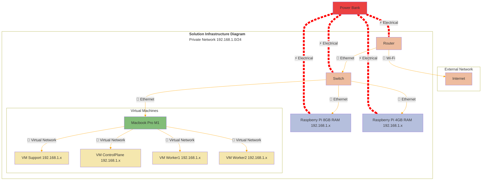

```mermaid
graph TD
    %% Color definitions
    classDef virtualMachine fill:#F5E7AE;
    classDef electricConnection stroke:#FFA500,stroke-width:2px;
    classDef raspberry fill:#B5BFDD;
    classDef network fill:#EEBC9F;
    classDef macbook fill:#82BD78;
    classDef power fill:#EB4141;
    classDef noBackground fill:none;

    subgraph extn["External Network"]
        Internet[Internet]
    end
    class extn noBackground;

    subgraph pvn["<b>Solution Infrastructure Diagram</b><br>Private Network 192.168.1.0/24"]
        Router:::network -->|🛜 Wi-Fi| Internet:::network
        Router -->|🔗  Ethernet| Switch:::network
        Switch -->|🔗  Ethernet| MacbookProM1[Macbook Pro M1]:::macbook
        Switch -->|🔗  Ethernet| RaspberryPi8GB[Raspberry Pi 8GB RAM 192.168.1.x]:::raspberry
        Switch -->|🔗  Ethernet| RaspberryPi4GB[Raspberry Pi 4GB RAM 192.168.1.x]:::raspberry
        
        subgraph vms["Virtual Machines"]
            Support[VM Support 192.168.1.x]:::virtualMachine
            ControlPlane[VM ControlPlane 192.168.1.x]:::virtualMachine
            Worker1[VM Worker1 192.168.1.x]:::virtualMachine
            Worker2[VM Worker2 192.168.1.x]:::virtualMachine
            MacbookProM1 -->|🔗 Virtual Network| Support
            MacbookProM1 -->|🔗 Virtual Network| ControlPlane
            MacbookProM1 -->|🔗 Virtual Network| Worker1
            MacbookProM1 -->|🔗 Virtual Network| Worker2
        end
    end

    class vms noBackground;
    class pvn noBackground;

    PowerBank[Power Bank]:::power -->|⚡ Electrical| RaspberryPi4GB
    PowerBank -->|⚡ Electrical|RaspberryPi8GB
    PowerBank -->|⚡ Electrical| Router
    PowerBank -->|⚡ Electrical| Switch


    linkStyle 0 stroke:orange;
    linkStyle 1 stroke:orange;
    linkStyle 2 stroke:orange;
    linkStyle 3 stroke:orange;
    linkStyle 4 stroke:orange;
    linkStyle 5 stroke:orange;
    linkStyle 6 stroke:orange;
    linkStyle 7 stroke:orange;
    linkStyle 8 stroke:orange;
    linkStyle 9 stroke:red,stroke-width:0.5em,stroke-dasharray: 10 5;
    linkStyle 10 stroke:red,stroke-width:0.5em,stroke-dasharray: 10 5;
    linkStyle 11 stroke:red,stroke-width:0.5em,stroke-dasharray: 10 5;
    linkStyle 12 stroke:red,stroke-width:0.5em,stroke-dasharray: 10 5;
```